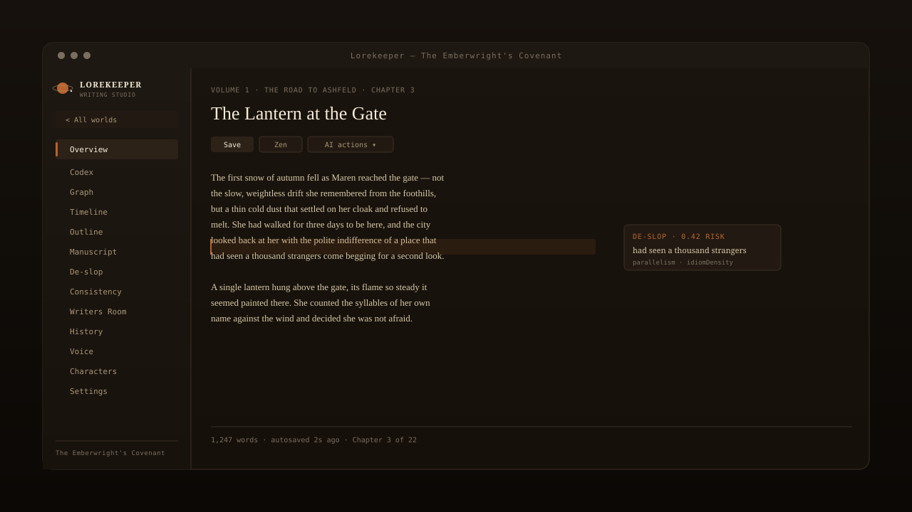

# Lorekeeper

<p align="center">
  
</p>

<p align="center">
  <a href="https://github.com/verdana/lorekeeper/releases"></a>
  <a href="./LICENSE"></a>
  <a href="#quick-start"></a>
  <a href="#where-your-data-lives"></a>
  <a href="#build-the-desktop-app-electron"></a>
</p>

<p align="center">
  <a href="#at-a-glance">At a glance</a> &middot;
  <a href="#whats-new-in-v020">What's new</a> &middot;
  <a href="#features">Features</a> &middot;
  <a href="#quick-start">Quick start</a> &middot;
  <a href="#privacy--security">Privacy</a> &middot;
  <a href="#development">Development</a>
</p>

<br>

Lorekeeper is a self-hosted writing studio for long-form fiction. It keeps your
codex (worldbuilding, characters, geography, plot outlines, timeline), your
manuscript, and an AI writers' room in one place — and stores **everything as
plain Markdown + JSON files on your own disk**.

> **No database. No cloud. No account.** Open the files in any editor, back
> them up, or put them under version control. Bring your own API key from
> any OpenAI-compatible provider (OpenAI, DeepSeek, Kimi, Qwen, a local
> Ollama…) and the app talks directly to it — nothing routes through us.

<table>
  <tr>
    <td width="22%" align="center"><strong>Local-first</strong></td>
    <td>Everything is plain Markdown + JSON on your disk. Diff it, grep it, back it up.</td>
  </tr>
  <tr>
    <td align="center"><strong>BYOK AI</strong></td>
    <td>Built-in presets for OpenAI, DeepSeek, Kimi, Qwen, Ollama and friends. Paste a key, test, done.</td>
  </tr>
  <tr>
    <td align="center"><strong>Multi-world</strong></td>
    <td>Run several projects side by side. Each world keeps its own codex, manuscript, timeline, and history.</td>
  </tr>
  <tr>
    <td align="center"><strong>Safety net</strong></td>
    <td>Automatic version snapshots before every save or deletion — recover if the AI garbles something.</td>
  </tr>
</table>

---

## At a glance

<p align="center">
  
</p>

<p align="center"><sub>The dark sidebar is your navigation; the main panel is whatever you're writing or reviewing right now. Fourteen workspace views, all wired to the same local files.</sub></p>

---

## What's new in v0.2.0

- **Story Memory** — extract durable facts from saved chapters only when you
  ask, then edit, confirm, reject, batch-review, export, import, or restore
  them. Only relevant author-confirmed memories are added to drafting context.
- **Scene Cards** — keep a chapter's POV, story date, location, participants,
  purpose, conflict, open threads, writing target, and linked timeline event in
  one explicit author-controlled card.
- **Connected Timeline** — link timeline events to chapters and searchable
  codex references, then jump directly to either from the event.
- **Command Palette** — one fast entry point for chapters, codex documents,
  timeline events, discussions, and snapshots.

## Features

The sidebar follows the writing workflow — codex first, then manuscript,
then the AI review and polishing tools.

### Codex & worldbuilding

| Module                 | What it does                                                                                                                                                                                                                                        |
| ---------------------- | --------------------------------------------------------------------------------------------------------------------------------------------------------------------------------------------------------------------------------------------------- |
| **Overview**           | Title, author, synopsis, tags; volume / chapter / word-count stats; codex overview; one-click **export** of the whole book as a `.zip`.                                                                                                             |
| **Codex**              | Worldbuilding, characters, geography, society & economy, plot outline, misc — Markdown docs with category-specific templates, an inline AI assistant (polish, expand, find gaps, suggest hooks), and bidirectional `[[wikilinks]]` between entries. |
| **Graph**              | Force-directed graph of every codex document; node size and colour follow category, edges are wikilinks. Spot orphan docs and tightly-coupled clusters at a glance.                                                                                 |
| **Timeline**           | World events with free-form date labels, ordered by `dateOrder`, searchable codex references, and links to the scenes that use each event.                                                                                                          |
| **Codex health**       | Stats panel on the codex overview: flags documents that are too short, untouched for too long, or disconnected from the rest of the world.                                                                                                          |
| **Static wiki export** | One click to publish the codex as a standalone, navigable HTML wiki you can host anywhere.                                                                                                                                                          |

### Manuscript

| Module         | What it does                                                                                                                                                                                                      |
| -------------- | ----------------------------------------------------------------------------------------------------------------------------------------------------------------------------------------------------------------- |
| **Manuscript** | Volume → chapter tree, full Markdown editor, **Zen mode**, autosave, live word counts, scene cards, and a unified AI actions dropdown (outline, continue, polish). Each chapter is a separate `.md` file on disk. |
| **Outline**    | A flat, scrollable view of every chapter — useful for reordering, regrouping into volumes, or doing a structural pass without opening the editor.                                                                 |

### AI review & polishing

| Module                | What it does                                                                                                                                                                                                                                                                                                                                                                                                                                                                                                                                                                                                         |
| --------------------- | -------------------------------------------------------------------------------------------------------------------------------------------------------------------------------------------------------------------------------------------------------------------------------------------------------------------------------------------------------------------------------------------------------------------------------------------------------------------------------------------------------------------------------------------------------------------------------------------------------------------- |
| **De-slop**           | Local 8-dimension detector (`burstiness`, `connectives`, `parallelism`, `abstractNouns`, `sentenceHeadRepetition`, `punctuationMonotony`, `idiomDensity`, `paragraphUniformity`) that scores 0–100 and highlights risky sentences. Per-sentence rewrite with **diff review** anchored to your Voice Profile, **batch chapter scan** with risk ranking, **Zhuque checklist export** (for offline checks against Tencent's AI-text detector), and **calibration**: feed back real Zhuque scores to re-fit the dimension weights via ridge regression. Rules pack is versioned so you know when an update is available. |
| **Consistency Check** | AI reads your codex and selected chapters to surface contradictions — name drift, timeline conflicts, system violations, forgotten setups. Each issue can be applied independently to the relevant codex document.                                                                                                                                                                                                                                                                                                                                                                                                   |
| **Story Memory**      | Extract durable story changes from saved chapters as reviewable suggestions. The author confirms canon; relevant confirmed facts, scene cards, and timeline context then guide drafting. Export, import, and recover Story Memory backups locally.                                                                                                                                                                                                                                                                                                                                                                   |
| **Writers' Room**     | Assemble AI personas and discuss a story problem — diverge for broad exploration, converge to drill one point. Moderator summarises; merge conclusions into the codex. Export transcripts. Preset templates for plot holes, character arcs, pacing.                                                                                                                                                                                                                                                                                                                                                                  |
| **Character Chat**    | One-on-one chat with an AI persona grounded in a character sheet from your codex. Useful for hearing a voice before you write it, or for sanity-checking motivation. Export the conversation.                                                                                                                                                                                                                                                                                                                                                                                                                        |
| **Voice**             | Build and edit your **Voice Profile** — the trait bundle that anchors de-slop rewrites, writers' room, and AI actions to your actual voice rather than a generic default.                                                                                                                                                                                                                                                                                                                                                                                                                                            |

### History & safety net

| Module      | What it does                                                                                                                                                                                      |
| ----------- | ------------------------------------------------------------------------------------------------------------------------------------------------------------------------------------------------- |
| **History** | Automatic version snapshots taken before every save or deletion across codex docs, chapters, and discussions. Recover a chapter or codex entry if the AI garbled it or you deleted it by mistake. |

### Multi-world & project switching

| Module        | What it does                                                                                                                                                                                                                                                                                                                       |
| ------------- | ---------------------------------------------------------------------------------------------------------------------------------------------------------------------------------------------------------------------------------------------------------------------------------------------------------------------------------- |
| **WorldGate** | The first thing you see on launch. Create worlds from a one-line AI prompt, from a seed folder, by **importing an existing manuscript** (each file becomes a chapter), or start blank. Edit a world's title, genre, and cover colour in place. Switch freely — every world keeps its own codex, manuscript, timeline, and history. |
| **Settings**  | Configure AI providers (with built-in presets for OpenAI, DeepSeek, Kimi, Qwen, Ollama and friends), edit prompt templates for writers' room / consistency / de-slop, manage max-tokens per provider, and inspect / export the rules pack.                                                                                         |

## Quick start

Requires [Node.js](https://nodejs.org/) and [pnpm](https://pnpm.io/).

```bash
pnpm install
pnpm dev              # dev server (hot reload) → http://localhost:5173
```

Build and serve the production site:

```bash
pnpm build
pnpm start            # serves built app + API → http://localhost:5178
```

Type-check the whole project:

```bash
pnpm typecheck
```

### Build the desktop app (Electron)

Pre-built binaries are available on the
[Releases](https://github.com/verdana/lorekeeper/releases) page — download the
installer for your platform and run it directly. No Node.js or build tools needed.

To build from source:

On Windows:

```bash
pnpm dist
```

On Linux / WSL (cross-build for Windows):

```bash
pnpm dist --win
```

Build for Linux (requires native dependencies):

```bash
pnpm dist --linux
```

Outputs a portable zip (`dist/Lorekeeper-0.1.0-win.zip`). Unzip and double-click
`Lorekeeper.exe` — no Node.js or install needed.

On first launch you get a small example world ("The Emberwright's Covenant") so
you can explore every feature immediately. Open **Settings → AI Providers**, add
your API key, and click **Test connection** to get started.

## Where your data lives

By default everything is stored under `~/.lorekeeper`:

```
worlds.json         index of your worlds
config.json         AI providers + personas (shared across worlds)
worlds/<id>/
  novel.json          volume/chapter structure
  outline.md          legacy single-file outline (read as fallback when outline/ is empty)
  outline/            manuscript outline documents (one or more Markdown files)
  timeline.json       world timeline events and codex references
  story-memory.json   author-reviewed durable story facts
  settings/           codex documents (Markdown, grouped by category)
  chapters/           chapter prose (Markdown)
  discussions/        writers' room sessions (JSON)
  .story-memory-backups/  automatic Story Memory backups
  .snapshots/         automatic version history
```

Override the location with the `ORBIT_DATA_DIR` environment variable.

## Project layout

```
src/
  renderer/        React + Vite frontend (TypeScript)
  server/          Local Express API (TypeScript)
  shared/          Types, prompts, the de-slop analyzer
electron/          Electron main process + builder config
assets/seed/       Bundled example world ("The Emberwright's Covenant")
scripts/           Dev tooling (changelog generator, etc.)
docs/              Design notes
```

## Development

- `pnpm dev` — start both the Vite dev server and the local API with hot
  reload.
- `pnpm typecheck` — run the TypeScript checker for both `tsconfig.web.json`
  and `tsconfig.node.json`.
- `pnpm lint` / `pnpm format` — ESLint and Prettier.
- `pnpm changelog` — generate a draft release-notes file by grouping
  conventional commits between two tags (see `scripts/gen-changelog.mjs`).
- Commits follow [Conventional Commits](https://www.conventionalcommits.org/)
  (enforced by commitlint + husky). Pre-commit runs Prettier on staged
  files; see `AGENTS.md` for the project house style.

## AI providers

Any service that implements the OpenAI `POST {baseUrl}/chat/completions` API
works:

- OpenAI — `https://api.openai.com/v1` (append `/v1`)
- DeepSeek — `https://api.deepseek.com` (no `/v1` suffix)
- Kimi / Moonshot — `https://api.moonshot.cn/v1` (append `/v1`)
- Local Ollama — `http://localhost:11434/v1` (append `/v1`)

Lorekeeper ships with built-in presets for these (and a few more) — pick
one in **Settings → AI Providers** and you only have to paste your key.

## Privacy & security

- **Local-first.** Your manuscript never leaves your machine except in the
  requests you make to the AI provider you configured.
- The local API only accepts requests from the app itself; other websites in
  your browser cannot reach it to read your API keys.
- Your API keys are encrypted on disk using your OS secure storage
  (Windows DPAPI / macOS Keychain).
- Path-traversal hardening, defensive SSE parsing, and global error
  handlers in the local API keep the surface tight.

## License

[Source Available — Non-Commercial](./LICENSE) © 2026 Verdana Mu
