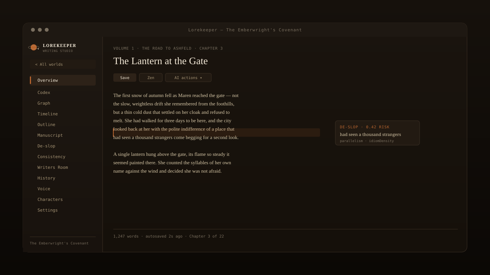

# Lorekeeper

<p align="center">
  
</p>

<p align="center">
  <a href="https://github.com/verdana/lorekeeper/releases"></a>
  <a href="./LICENSE"></a>
  <a href="#quick-start"></a>
  <a href="#where-your-data-lives"></a>
  <a href="#build-the-desktop-app-electron"></a>
</p>

<p align="center">
  <a href="#at-a-glance">At a glance</a> &middot;
  <a href="#whats-new-in-v030">What's new</a> &middot;
  <a href="#features">Features</a> &middot;
  <a href="#quick-start">Quick start</a> &middot;
  <a href="#privacy--security">Privacy</a> &middot;
  <a href="#development">Development</a>
</p>

<br>

Lorekeeper is a self-hosted writing studio for long-form fiction. It keeps your
codex (worldbuilding, characters, geography, plot outlines, timeline), your
manuscript, and an AI writers' room in one place — and stores **everything as
plain Markdown + JSON files on your own disk**.

> **No database. No cloud. No account.** Open the files in any editor, back
> them up, or put them under version control. Bring your own API key from
> any OpenAI-compatible provider (OpenAI, DeepSeek, Kimi, Qwen, a local
> Ollama…) and the app talks directly to it — nothing routes through us.

<table>
  <tr>
    <td width="22%" align="center"><strong>Local-first</strong></td>
    <td>Everything is plain Markdown + JSON on your disk. Diff it, grep it, back it up.</td>
  </tr>
  <tr>
    <td align="center"><strong>BYOK AI</strong></td>
    <td>Built-in presets for OpenAI, DeepSeek, Kimi, Qwen, Ollama and friends. Paste a key, test, done.</td>
  </tr>
  <tr>
    <td align="center"><strong>Multi-world</strong></td>
    <td>Run several projects side by side. Each world keeps its own codex, manuscript, timeline, and history.</td>
  </tr>
  <tr>
    <td align="center"><strong>Safety net</strong></td>
    <td>Automatic version snapshots before every save or deletion — recover if the AI garbles something.</td>
  </tr>
</table>

---

## At a glance

<p align="center">
  
</p>

<p align="center"><sub>The dark sidebar is your navigation; the main panel is whatever you're writing or reviewing right now. Every workspace view is wired to the same local files.</sub></p>

---

## What's new in v0.3.0

- **Novel Forge** — give it a theme and it grows a whole book: story concept →
  story bible → chapter outline → chapter prose, with continuity memory
  rebuilt after every chapter. Pausable, resumable across restarts, and fully
  inspectable — every model call is recorded with its provider, timing, output
  and token cost.
- **Continuity by construction** — each chapter is drafted with the story
  bible, its own beats, the current story state and the previous chapter's
  ending in context, and its summary feeds the next chapter before it starts.
  A non-destructive continuity pass then files findings into the Review Queue.

## What's new in v0.2.1

- **Persistent Review Queue** — turn saved consistency reports into durable,
  document-linked issues. Track every item from open through fixing and
  verification to author-controlled resolution.
- **Multi-file Outline** — manage a book outline as multiple Markdown
  documents, merge them for AI context and consistency review, then export the
  original documents as a zip.
- **Connected Review Workflow** — save and browse consistency reports; promote
  character-chat discoveries and writers' room conclusions into the codex,
  outline, timeline, or Story Memory.
- **Writers' Room Timeline** — navigate long discussions by round, with a
  fixed scroll timeline that follows the active exchange.
- **Focused usability improvements** — a collapsible sidebar, resilient
  outline loading, and codex wikilinks that also work without a `.md` suffix.

## Features

The sidebar follows the writing workflow — overview and forge first, then codex,
outline and manuscript, then the AI review and polishing tools.

### Novel Forge — theme to whole book

The **Forge** view (and the _From a theme_ card on the world picker) starts from
one thing: a theme. From there the pipeline runs in stages, each one written to
disk before the next begins.

| Stage           | What it produces                                                                                                                                                                                                                      |
| --------------- | ------------------------------------------------------------------------------------------------------------------------------------------------------------------------------------------------------------------------------------- |
| **Concept**     | The book's identity: title, genre, logline, synopsis, themes, tone, viewpoint, a prose style guide, and the cast with wants, fears and contradictions.                                                                                |
| **Story bible** | Codex documents — world rules with their costs, geography, factions, history, character sheets — wired together with `[[wikilinks]]`.                                                                                                 |
| **Outline**     | Volumes, chapters and three-to-six beats per chapter, written into the structured outline and mirrored into the manuscript tree as empty chapters.                                                                                    |
| **Chapters**    | Prose, one chapter at a time. Each chapter is drafted with the story bible, its own beats, the accumulated story state and the previous chapter's ending.                                                                             |
| **Continuity**  | After each chapter, a structured summary rebuilds the story state — the per-chapter summary and the accumulated archive — so the next chapter starts where the last one ended.                                                        |
| **Review**      | A non-destructive continuity and causality pass. Findings reach the Review Queue and a saved consistency report, and stay on the run with an **Act on this** action: writing that chapter again under the finding as its instruction. |

Runs are pausable and resumable: state lives in `forge/run.json`, the next step
is derived from what is already on disk, and every model call is recorded with
its provider, timing, token usage (the provider's figure when it reports one,
an estimate otherwise) and output. Switching worlds or closing the app pauses
the run rather than letting it write into the wrong project. Nothing is written
silently over existing prose — a world that already has chapters must be
explicitly marked for replacement, and every write still snapshots first, so
History can undo it.

#### Steering a run

A whole book is long enough that you learn what it needs while it is being
written, so Forge is not a one-way slot machine:

- **Direction** — write a standing instruction in the Forge view ("stop
  resolving her memory loss", "the sister must appear before the trial") and
  every chapter from the one you name onwards is drafted under it. Direction is
  binding: where it disagrees with the plan, it wins.
- **Write a chapter again** — any drafted chapter can be reset and written
  again, optionally with a one-off instruction ("too slow — start in the middle
  of the argument, keep the beats"). Its summary is regenerated so continuity
  stays honest; later chapters keep the version they were written against, and
  Forge tells you how many of them that is.
- **Keep going** — when planned chapters remain undrafted you can continue with
  just the next one or all of them. When the plan itself runs out, **Plan more
  chapters** commissions the next arc from what has actually happened — what is
  still open, what has been paid off — and drafts it. The continuity review runs
  again over everything written since it last looked.

Author edits made while a run is live are applied to the run itself, not to a
copy — the pipeline picks them up at its next step.

#### The chapter contract

Beats say what happens; the contract says what the author has decided about it.
Each chapter can carry five author decisions — the one event it must deliver,
the viewpoint character's immediate goal, the state it opens in, the state it
has to leave the story in, and what must not be revealed or changed yet.

The planner proposes a contract for every chapter it plans. You can edit any of
them in the Outline view (the chapter's **Contract** marker shows which chapters
carry one), and they are binding on every prompt that writes or revises that
chapter — the first draft, a re-draft, a continuation, and the continuity review
that judges the result. Leave a field empty and that decision goes back to the
model.

The outline is the authority: edits you make to a chapter's beats or contract
after the plan was written are what the next draft is held to, not the version
the run started with.

### Codex & worldbuilding

| Module                 | What it does                                                                                                                                                                                                                                        |
| ---------------------- | --------------------------------------------------------------------------------------------------------------------------------------------------------------------------------------------------------------------------------------------------- |
| **Overview**           | Title, author, synopsis, tags; volume / chapter / word-count stats; codex overview; one-click **export** of the whole book as a `.zip`.                                                                                                             |
| **Codex**              | Worldbuilding, characters, geography, society & economy, plot outline, misc — Markdown docs with category-specific templates, an inline AI assistant (polish, expand, find gaps, suggest hooks), and bidirectional `[[wikilinks]]` between entries. |
| **Graph**              | Force-directed graph of every codex document; nodes are coloured by category and edges are wikilinks. Spot orphan docs and tightly-coupled clusters at a glance.                                                                                    |
| **Timeline**           | World events with free-form date labels, ordered by `dateOrder`, searchable codex references, and chapter links back into the manuscript.                                                                                                           |
| **Codex Stats**        | Collapsible stats panel in the Codex sidebar: document and word counts per category, plus the entries that are still empty, placeholder, or under-developed, each with a one-click expand.                                                          |
| **Static wiki export** | One click to publish the codex as a standalone, navigable HTML wiki you can host anywhere.                                                                                                                                                          |

### Manuscript

| Module         | What it does                                                                                                                                                                                                                                                                                                                                                                             |
| -------------- | ---------------------------------------------------------------------------------------------------------------------------------------------------------------------------------------------------------------------------------------------------------------------------------------------------------------------------------------------------------------------------------------- |
| **Manuscript** | Volume → chapter tree (structure is maintained in Outline), full Markdown editor, **Zen mode**, autosave, live word counts, and an **AI Assist** dropdown (outline write, rewrite) that drafts from the outline and the accumulated story state; the built-in prompts carry the prose-quality rules (cut AI tells, vary sentence rhythm). Each chapter is a separate `.md` file on disk. |
| **Outline**    | The structured plan for the book — volumes, chapters and their beats with statuses, plus AI-assisted chapter planning. It is the structure source of truth, its serialization feeds AI context and consistency review, and it exports as a `.zip` (`outline.json` plus a derived `outline.md`).                                                                                          |

### AI review & polishing

| Module                | What it does                                                                                                                                                                                                                                                                                                                                                                                |
| --------------------- | ------------------------------------------------------------------------------------------------------------------------------------------------------------------------------------------------------------------------------------------------------------------------------------------------------------------------------------------------------------------------------------------- |
| **Consistency Check** | AI reads your selected codex documents, the outline, and selected chapters to surface contradictions — name drift, timeline conflicts, system violations, forgotten setups. Save reports, browse them later, and follow linked codex references.                                                                                                                                            |
| **Review Queue**      | Import actionable findings from saved consistency reports into a persistent queue. Each item keeps its evidence, linked document, severity, state, and fix target until the author resolves it.                                                                                                                                                                                             |
| **Continuity**        | One workspace for everything the book must stay true to, in two tabs. **Story state** is derived automatically after every chapter: where each character is, what they carry, what they want, and **what they know** (so a character cannot act on information the book never gave them). **Facts** is what you reviewed and confirmed by hand. Both are injected into the writing prompts. |
| **Writers' Room**     | Assemble AI personas and discuss a story problem — diverge for broad exploration, converge to drill one point. Navigate long sessions by round; promote merged conclusions into the codex, timeline, or Facts.                                                                                                                                                                              |
| **Character Chat**    | One-on-one chat with an AI persona grounded in a character sheet from your codex. Sessions persist per character, and confirmed discoveries can be promoted into the codex or Facts.                                                                                                                                                                                                        |
| **Voice**             | Build and edit your **Voice Profile** — the traits extracted from your own prose samples, or a hand-written description, that the AI Assist writing prompts follow so drafts stay in your voice rather than a generic default.                                                                                                                                                              |

### History & safety net

| Module      | What it does                                                                                                                                                                                                                                                                                                                                      |
| ----------- | ------------------------------------------------------------------------------------------------------------------------------------------------------------------------------------------------------------------------------------------------------------------------------------------------------------------------------------------------- |
| **History** | Automatic version snapshots before every save or deletion across chapters, codex docs, outlines, timeline data, discussions, voice profiles, world metadata, review queue, and character chats. Preview each version as raw text or a red/green diff against the current version, then restore with one click — every restore is itself undoable. |

### Multi-world & project switching

| Module        | What it does                                                                                                                                                                                                                                                                                                                       |
| ------------- | ---------------------------------------------------------------------------------------------------------------------------------------------------------------------------------------------------------------------------------------------------------------------------------------------------------------------------------- |
| **WorldGate** | The first thing you see on launch. Create worlds from a one-line AI prompt, from a seed folder, by **importing an existing manuscript** (each file becomes a chapter), or start blank. Edit a world's title, genre, and cover colour in place. Switch freely — every world keeps its own codex, manuscript, timeline, and history. |
| **Settings**  | Configure AI providers (with built-in presets for OpenAI, DeepSeek, Kimi, Qwen, Ollama and friends) and the max tokens for each; edit the writers' room personas, the consistency-check prompts, and the manuscript writing prompts.                                                                                               |

## Quick start

Requires [Node.js](https://nodejs.org/) and [pnpm](https://pnpm.io/).

```bash
pnpm install
pnpm dev              # dev server (hot reload) → http://localhost:5173
```

Build and serve the production site:

```bash
pnpm build
pnpm start            # serves built app + API → http://localhost:5178
```

Type-check the whole project:

```bash
pnpm typecheck
```

### Build the desktop app (Electron)

Pre-built binaries are available on the
[Releases](https://github.com/verdana/lorekeeper/releases) page — download the
installer for your platform and run it directly. No Node.js or build tools needed.

To build from source:

On Windows:

```bash
pnpm dist
```

On Linux / WSL (cross-build for Windows):

```bash
pnpm dist --win
```

Build for Linux (requires native dependencies):

```bash
pnpm dist --linux
```

Outputs a portable zip (`dist/Lorekeeper-0.3.0-win.zip`). Unzip and double-click
`Lorekeeper.exe` — no Node.js or install needed.

On first launch you get a small example world ("The Emberwright's Covenant") so
you can explore every feature immediately. Open **Settings → AI Providers**, add
your API key, and click **Test connection** to get started.

Want to see the whole pipeline run? Open **Forge**, type a theme, and press
**Forge the novel** — or use the **From a theme** card on the world picker to
create a fresh world for it. Pick _Plan only_ if you would rather write the prose
yourself; the concept, story bible and chapter outline are still generated.

## Where your data lives

By default everything is stored under `~/.lorekeeper`:

```
worlds.json         index of your worlds
config.json         AI providers + personas (shared across worlds)
worlds/<id>/
  novel.json          volume/chapter structure (mirrors the outline store)
  outline/            structured outline store (outline.json; legacy outline/*.md migrate on first read)
  timeline.json       world timeline events and codex references
  story-memory.json   author-reviewed durable story facts
  chapter-memory/     per-chapter summaries and the accumulated story state
  review-queue.json   persistent review items and their state
  exemplars.json      style exemplar passages injected into writing prompts
  voice-profile.json  your Voice Profile (traits and samples)
  settings/           codex documents (Markdown, grouped by category)
  chapters/           chapter prose (Markdown)
  discussions/        writers' room sessions (JSON)
  character-chats/    persistent character chat sessions
  consistency/        saved consistency reports
  generation-runs/    recorded generation evidence for the writing pipeline
  forge/              Novel Forge run state (run.json: stages, steps, evidence)
  .story-memory-backups/  automatic Story Memory backups
  .snapshots/         automatic version history
```

Override the location with the `ORBIT_DATA_DIR` environment variable.

## Project layout

```
src/
  renderer/        React + Vite frontend (TypeScript)
  server/          Local Express API (TypeScript)
  shared/          Shared types, prompt packs, and pure logic
electron/          Electron main process + builder config
assets/seed/       Bundled example world ("The Emberwright's Covenant")
scripts/           Dev tooling (changelog generator, etc.)
docs/              Design notes
```

## Development

- `pnpm dev` — start both the Vite dev server and the local API with hot
  reload.
- `pnpm typecheck` — run the TypeScript checker for both `tsconfig.web.json`
  and `tsconfig.node.json`.
- `pnpm lint` / `pnpm format` — ESLint and Prettier.
- `pnpm changelog` — generate a draft release-notes file by grouping
  conventional commits between two tags (see `scripts/gen-changelog.mjs`).
- Commits follow [Conventional Commits](https://www.conventionalcommits.org/)
  (enforced by commitlint + husky). Pre-commit runs Prettier on staged
  files; see `AGENTS.md` for the project house style.

## AI providers

Any service that implements the OpenAI `POST {baseUrl}/chat/completions` API
works:

- OpenAI — `https://api.openai.com/v1` (append `/v1`)
- DeepSeek — `https://api.deepseek.com` (no `/v1` suffix)
- Kimi / Moonshot — `https://api.moonshot.cn/v1` (append `/v1`)
- Local Ollama — `http://localhost:11434/v1` (append `/v1`)

Lorekeeper ships with built-in presets for these (and a few more) — pick
one in **Settings → AI Providers** and you only have to paste your key.

## Privacy & security

- **Local-first.** Your manuscript never leaves your machine except in the
  requests you make to the AI provider you configured.
- The local API only accepts requests from the app itself; other websites in
  your browser cannot reach it to read your API keys.
- Your API keys are encrypted on disk using your OS secure storage
  (Windows DPAPI / macOS Keychain).
- Path-traversal hardening, defensive SSE parsing, and global error
  handlers in the local API keep the surface tight.

## License

[Source Available — Non-Commercial](./LICENSE) © 2026 Verdana Mu
